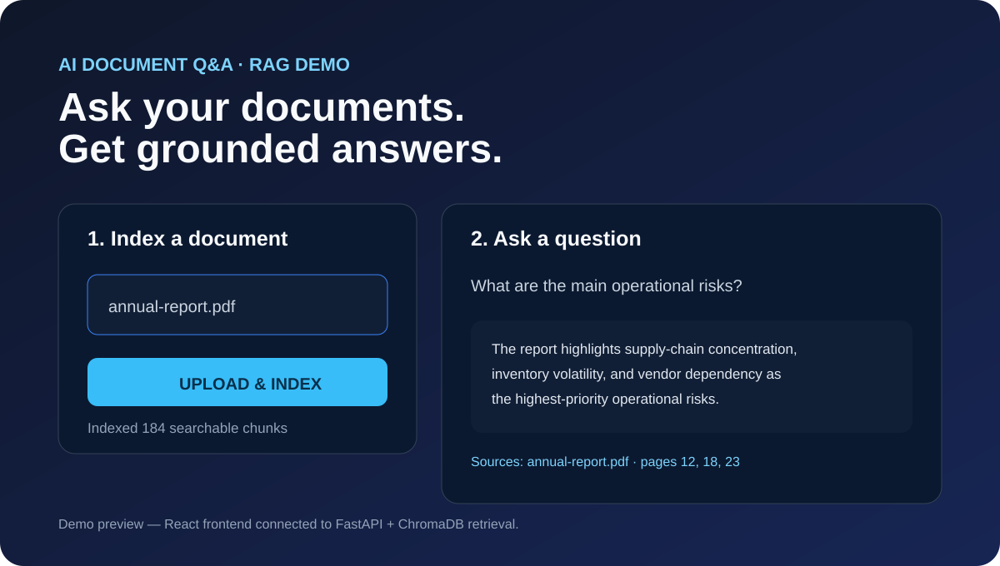
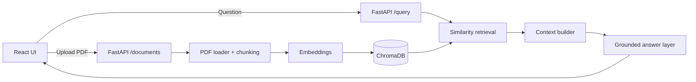

# AI-Powered Document Q&A System

> Full-stack Retrieval-Augmented Generation application built with **FastAPI, React, LangChain, sentence-transformer embeddings, and ChromaDB**.



The system lets a user upload a PDF, converts the document into searchable vector chunks, retrieves the most relevant context for a question, and returns a grounded answer with source metadata.

## What this project demonstrates

- Full-stack application design with a **React/Vite frontend** and **FastAPI backend**
- PDF ingestion and text preprocessing
- Recursive chunking with configurable overlap
- Vector embeddings and persistent ChromaDB storage
- Semantic similarity retrieval
- Context construction for RAG
- Source-aware answers for traceability
- REST API design and OpenAPI/Swagger documentation
- Dockerized backend, automated tests, and GitHub Actions CI

## Architecture



Detailed design: [docs/ARCHITECTURE.md](docs/ARCHITECTURE.md)

## Repository structure

```text
AI-Powered-Document-QA-System/
├── app/
│   ├── main.py                 # FastAPI routes, upload/query API, CORS
│   └── rag.py                  # ingestion, chunking, embeddings, vector retrieval, answering
├── frontend/
│   ├── src/
│   │   ├── App.jsx             # upload + question UI
│   │   ├── main.jsx
│   │   └── styles.css
│   ├── index.html
│   ├── package.json
│   └── vite.config.js
├── tests/
│   └── test_api.py
├── docs/
│   ├── ARCHITECTURE.md
│   └── demo.svg
├── .github/workflows/
│   └── ci.yml
├── Dockerfile
├── requirements.txt
├── .env.example
└── README.md
```

## Backend API

| Endpoint | Method | Purpose |
|---|---|---|
| `/health` | GET | Service health check |
| `/documents` | POST | Upload and index a PDF |
| `/query` | POST | Ask a question over indexed documents |

### Example query

```json
POST /query
{
  "question": "What are the main risks discussed in the report?",
  "top_k": 4
}
```

Example response shape:

```json
{
  "answer": "...",
  "sources": [
    {"source": "annual_report.pdf", "page": 12}
  ]
}
```

## Run locally

### 1. Backend

```bash
git clone https://github.com/Avantika1120/AI-Powered-Document-QA-System.git
cd AI-Powered-Document-QA-System
python -m venv .venv
source .venv/bin/activate   # Windows: .venv\Scripts\activate
pip install -r requirements.txt
cp .env.example .env
uvicorn app.main:app --reload
```

Backend: `http://localhost:8000`  
Swagger: `http://localhost:8000/docs`

### 2. React frontend

```bash
cd frontend
npm install
npm run dev
```

Frontend: `http://localhost:5173`

For a deployed backend, set `VITE_API_URL` before building the frontend.

## Docker

```bash
docker build -t document-qa-api .
docker run --env-file .env -p 8000:8000 document-qa-api
```

## Key engineering decisions

- **Separation of concerns:** HTTP/API logic lives in `app/main.py`; RAG/retrieval behavior lives in `app/rag.py`.
- **Persistent vector store:** ChromaDB keeps indexed embeddings across backend restarts.
- **Provider-independent retrieval:** embeddings and retrieval can work independently of the configured answer-generation model.
- **Traceability:** chunk metadata retains document/source context for citation-aware answers.
- **Frontend-ready API:** CORS is environment-configurable and defaults to the local React development server.
- **Reproducibility:** requirements, Docker, tests, and CI are committed with the application.

## Evaluation note

The repository implements the engineering workflow behind the resume project. Claims such as **10K+ searchable chunks** or **85%+ answer accuracy** should be reported only when reproduced with the corresponding evaluation dataset/harness; those values are not hard-coded into this application.

## Next improvements

- Retrieval evaluation: Recall@K, MRR, groundedness, faithfulness
- Conversation history and multi-document filtering
- Authentication and rate limiting
- Async background document indexing
- S3 ingestion and managed vector storage
- Redis caching
- AWS deployment behind API Gateway / ECS
