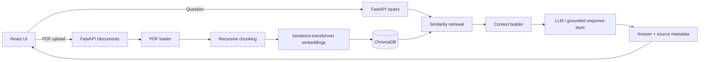

# Architecture

## Request flow

1. The React client uploads a PDF to `POST /documents`.
2. FastAPI writes the upload to a temporary file and delegates indexing to `RAGService`.
3. `RAGService` loads pages, splits text into overlapping chunks, generates embeddings, and persists them in ChromaDB with source/page metadata.
4. A user question is sent to `POST /query` with a configurable `top_k`.
5. ChromaDB returns the most semantically similar chunks.
6. The answer layer constructs context from those chunks and returns an answer plus the retrieved sources.
7. The React client renders the answer and source metadata side by side.

## Design decisions

- **FastAPI** keeps the backend small, typed, testable, and easy to expose through OpenAPI.
- **ChromaDB** provides persistent local vector storage suitable for a portfolio/demo deployment.
- **Sentence-transformer embeddings** keep retrieval independent from the answer-generation provider.
- **Source metadata** is retained through ingestion so every answer can surface traceability.
- **React + Vite** provides a lightweight user-facing workflow instead of exposing only Swagger.
- **Environment-based configuration** keeps model/provider keys and CORS settings outside source control.

## Production extensions

For production, document ingestion can move to S3 + an async worker queue, Chroma can be replaced by a managed vector database, authentication/rate limiting can sit in front of FastAPI, and the frontend/backend can be deployed independently behind a CDN/API gateway.
